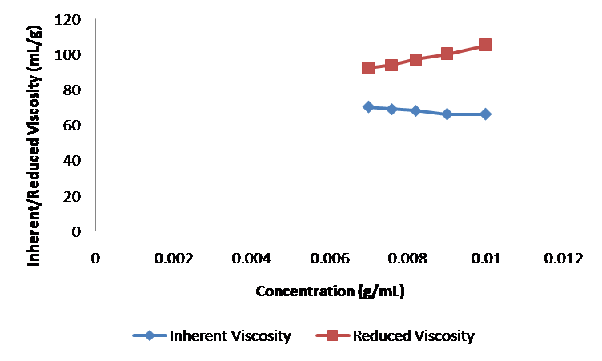
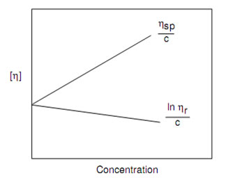

### Theory 

Viscosity is an internal property of a fluid that offers resistance to flow. It is due to the internal friction of molecules and mainly depends on the nature &amp; temperature of the liquid.

Many methods are available for measuring viscosity of polymer solution. The Ostwald method is a simple method for the measurement of viscosity, in which viscosity of liquid is measured by comparing the viscosity of an unknown liquid with that of liquid whose viscosity is known. In this method viscosity of liquid is measured by comparing the flow times of two liquids of equal volumes using same viscometer.

Consider two liquids are passing through a capillary of same viscometer. Then the coefficient of viscosity of liquid (η2) is given by equation

$$\eta_2=\frac{\eta_1\rho_2t_2}{\rho_1t_1}$$

Here $t_1$ and $t_2$ are the time of flow of the liquids and $\rho_1$ and $\rho_2$ are the respective densities. And $\eta_1$ is the coefficient of viscosity of water.

For a given liquid η has a specific value at the same temperature.

Various mixtures of two non-interacting liquids viscosities will lie among the viscosities of those pure components.

The time of flow of liquid depends on the viscosity and composition. In this method the flow times are measured for different known compositions and a graph is plot for time of flow and compositions. The unknown composition can be determined by plotting a graph for the time of flow and compositions.

 

The molecular weight of the polymer is measured by using viscometer and the molecular weight obtained by this technique is called viscosity average molecular weight. The molecular weight of the polymer solution is very high so the viscosity of polymer solution is very high compared to that of pure solvent. 

 

From the Mark-Houwink equation the relationship among the molecular weight and viscosity are given below

$$[\eta]=KM^\alpha$$

Where $[\eta]$  is the intrinsic viscosity , $M$ is Molecular weight, $K$ and $\alpha$ re constants for a particular polymer solvent  system.

If we know the $K$ and $\alpha$ values for a given polymer solution the intrinsic viscosity and molecular weight can be calculate using the above equation.

  <table>
    <thead>
      <tr>
        <th>Polymer-solvent system</th>
        <th>K x 103 mL/g</th>
        <th>
          <math xmlns="http://www.w3.org/1998/Math/MathML">
            <mi>α</mi>
          </math>
        </th>
      </tr>
    </thead>
    <tbody>
      <tr>
        <td>PMMA-Acetone</td>
        <td>7.70</td>
        <td>0.70</td>
      </tr>
      <tr>
        <td>PMMA-Benzene</td>
        <td>5.20</td>
        <td>0.76</td>
      </tr>
      <tr>
        <td>PMMA-Toluene</td>
        <td>7.0</td>
        <td>0.71</td>
      </tr>
      <tr>
        <td>Poly vinyl acetate-Acetone</td>
        <td>10.2</td>
        <td>0.72</td>
      </tr>
      <tr>
        <td>Poly vinyl acetate-Benzene</td>
        <td>56.3</td>
        <td>0.62</td>
      </tr>
      <tr>
        <td>Poly vinyl acetate-Acetonitrile</td>
        <td>41.5</td>
        <td>0.62</td>
      </tr>
      <tr>
        <td>Poly vinyl alcohol-Water</td>
        <td>45.3</td>
        <td>0.64</td>
      </tr>
      <tr>
        <td>Poly styrene-Benzene</td>
        <td>10.6</td>
        <td>0.735</td>
      </tr>
      <tr>
        <td>Poly styrene-Toluene</td>
        <td>11.0</td>
        <td>0.725</td>
      </tr>
    </tbody>
  </table>

### Terms Related to Viscosity Measurements:-
 
$$\text{Relative Viscosity}=\frac{\eta}{\eta_0}=\frac{t}{t_0}=\eta_r$$

$$\text{Specific Viscosity }=\frac{\eta-\eta_0}{\eta_0}=\frac{t-t_0}{t_0}=\eta_r-1=\eta_{sp}$$

$$\text{Reduced Viscosity }=\frac{\eta_{sp}}{C}=\eta_{red}$$

$$\text{Inherent Viscosity}=\frac{ln (\eta_{r})}{C}=\eta_{ln h}$$

$$\text{Intrinsic Viscosity}=\left( \frac{\eta_{sp}}{C}\right)_{c\to 0}=\left( \frac{ln \space \eta_{r}}{C}\right)_{c\to 0}=[\eta]$$

or measuring intrinsic viscosity of polymer sample, solutions of known concentrations are prepared, the flow times of solvent ( $t_0$ ) and the solutions, ( $t$ ) are measured using viscometer. Double extrapolation plots of reduced viscosity against concentration and inherent viscosity against concentration is plotted by calculating the corresponding reduced viscosity and inherent viscosity. The intrinsic viscosity is given by the common ordinate intercept of these graphs.

  

 

